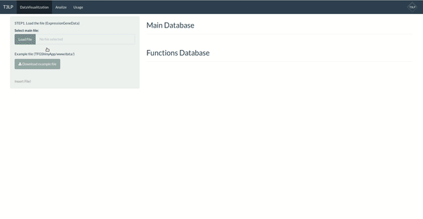

# T3LP: Protocolo de análisis de datos genéticos en Shiny.

Repositorio oficial del trabajo de final de grado.

### Descargar repositorio desde el navegador
Para descargar el repositorio, hay una opción en verde "Clone or download" para descargarlo en ".ZIP".

### Descargar repositorio desde la terminal
Para clonar el repositorio localmente, es necesario ejecutar la siguiente linea en la terminal de Linux:

```
git clone https://github.com/djangosee/TFGShinyApp.git
```
### Cómo abrir la aplicación con Rstudio

1. Extraer el ".ZIP" en una carpeta local.
2. Ejecutar el proyecto `simba2.Rproj`
3. Ejecutar todas las lineas de código que encontramos en App.r; La aplicación se abrirá automáticamente.

## GIF **ExampleFile.xlsx**



Autor: Antonio Rodríguez Gómez
