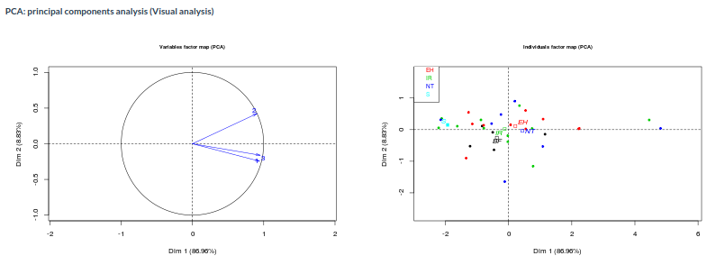

```{r setup, include=FALSE}
knitr::opts_chunk$set(echo = TRUE, size = "footnotesize")
```

# Contexto experimental

1. {width=50px}: Científicos experimentales.

2. {width=50px}: Especialistas en genética obtienen la matriz de expresión genética.

3. GEA: Creación de un protocolo de análisis, interpretación de resultados, creación de una aplicación.

4. {width=50px} + GEA: Interpretación en el contexto experimental, mejoras ...


# Datos de expresión genética

- Pocos casos.
- Datos faltantes (NA).
- Variables: funcionalidad del gen, tratamientos...

{width=200px}

# Protocolo de análisis

## Objetivos del análisis

1. Analizar y comparar los diferentes tratamientos y como afectan a la expresión de los genes seleccionados.
2. Encontrar relaciones entre la funcionalidad del gen y su expresión bajo diferentes tratamientos.

# Protocolo de análisis

## Hipótesis planteadas

1. En algún gen (y cuál o cuáles) hay diferencias significativas entre los niveles de expresión entre tratamientos?

\center
  $H_0: \mu_1 = \mu_2  = ... = \mu_k$
\center

2. Entre cuáles tratamientos (parejas) hay diferencias significativas?

\center
  $H_{0}: \mu_i = \mu_j \text{ para cada pareja de medias }  i \neq j$


# Análisis inferencial

- ANOVA para comparar medias entre diversos grupos/tratamientos.
- Normalidad, varianza igual e independencia.
- Logaritmo en los datos para normalizarlos.
```{r,results='asis',echo=F,eval=T,message=FALSE,warning=F}
options(xtable.comment = FALSE)
require(xtable)
taula <- data.frame("Gen"=c("TFF3"),"F"=c(5.295),"Pvalor"=c(0.005))
colnames(taula) <- c("Gen","$F_{k-1,N-k}$","P-valor")
rownames(taula) <- ""
print(xtable(taula,digits=c(0,0,2,3)),sanitize.text.function=function(x){x})

```
- Suponemos que tenemos 50 genes, aplicamos el ANOVA para cada gen y listo?

# Análisis inferencial

- Cuando realizamos un test podemos cometer el error de rechazar la hipótesis nula cuando realmente es cierta. (Error de tipo I)

## Cálculo de probabilidades
- Si $H_{0}$ es cierta: $P(FP)=\alpha$ y $P(VP)=1-\alpha$
- $P($Almenos un $FP$ en $m$ tests$)=1-(1-\alpha)^m$
- Para $m=1$, $P($Almenos...$)= 1-(1-0.05)^1=0.05$
- Para $m=50$, P(Almenos...$)= 1-(1-0.05)^{50}=0.92$

# Análisis inferencial

- Corregir los p-valores para controlar el error de tipo I

## False Discovery Rate (FDR)
- Proporción esperada de falsos positivos entre todos los tests considerados como significativos.
- El método para controlar el FDR: Benjamini$\&$Hochberg.

```{r,results='asis',echo=F,eval=T,message=FALSE,warning=F}
options(xtable.comment = FALSE)
require(xtable)
taula <- data.frame("Gen"=c("Gen1","Gen2","Gen3"),"Pvalor"=c(0.003,0.02,0.45))
taula <- cbind(taula,p.adjust(taula[,2],method="BH"))
colnames(taula) <- c("Gen","P-valor","P-valor.BH")
print(xtable(taula,digits=c(0,0,3,3),row.names=F),sanitize.text.function=function(x){x},scale=0.75)


```

# Análisis inferencial

- De los genes que han salido significativos en el ANOVA, hacemos comparaciones 2 a 2 entre las medias de los grupos.

{width=200px}

# Análisis exploratorio

1. Heatmap : explorar la doble agrupación (*clustering*) de genes y muestras.

{width=200px}

# Análisis exploratorio

2. Representación ACP : explorar las correlaciones entre las medias de los tratamientos. 

{width=400px}

# Análisis exploratorio

3. LinePlot : comparar las medias de los tratamientos a lo largo de los genes.

{width=200px}

# Aplicación en Shiny

La idea principal era crear una herramienta de análisis para los grupos de investigación.

- Desarrollada en R con el paquete Shiny.
- Interactiva, sencilla y accesible.
- Repositorio público.

https://github.com/djangosee/TFGShinyApp

# Conclusiones

- Se ha descrito un protocolo de análisis capaz de analizar y explorar diversos aspectos de una matriz de expresión genética.
- La implementación del protocolo en una aplicación va a facilitar futuros análisis a los investigadores.
- La posibilidad de añadir mejoras en la aplicación. (Futuras versiones)
- Carácter multidisciplinario del trabajo: estadística, biomedicina y bioinformática.
