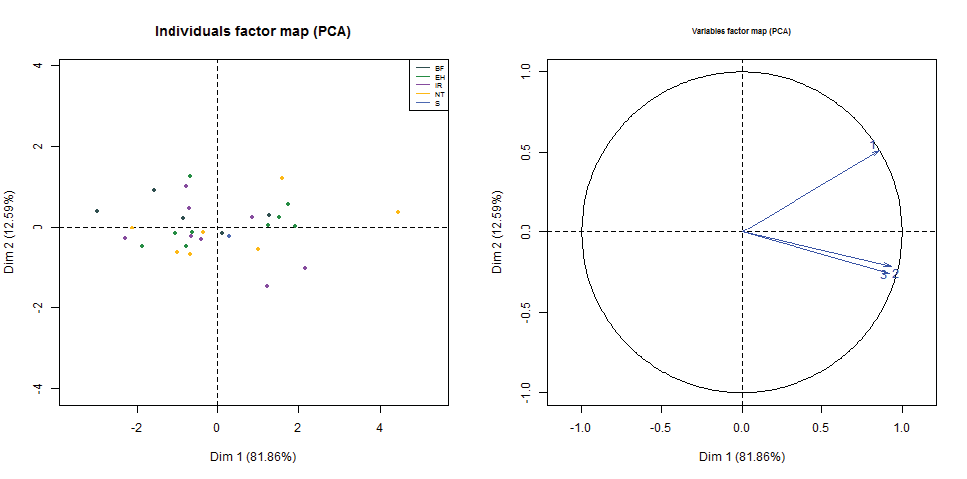

### Exemple: ACP casos = gens, variables =  mitjanes dels tractaments

**Gràfica de variables (expressions mitjanes dels tractaments)**

 - La primera component explica aproximadament un 82\% de la variabilitat total de les mitjanes en els diversos gens. La segona component contribueix en un 13\% aproximadament. Globalment, en dimensió 2 la pèrdua d'informació dels nivells mitjans d'expressió és només d'un 5\%.
 - Totes les variables (les tres mitjanes) estan ben representades amb les dues primeres components.
 - Es pot observar una correlació molt alta i positiva entre el tractament 3 i el tractament 1, en mitjana.
 - La correlació del tractament 2 amb els altres tractaments és més feble, també positiva (angle menor de 90º).
 - La *primera component* (eix horitzontal) està correlacionada amb les tres mitjana, la qual cosa indica valors alts d'expressió mitjana en tots tres tractaments.
 
**Obs:** Que les mitjanes estiguin correlacionades o no, en cap cas implica l'existència o no de diferències significatives. Correlació i diferències són dos aspectes diferents de l'anàlisi. Per exemple, dos tractaments podrien estar molt correlacionats  i presentar diferències significatives en diversos gens o no presentar-ne en cap. Inversament, dos tractaments poc correlacionats podrien no tenir cap diferència significativa o tenir-ne en molts gens. 

**Gràfica de casos (gens)** 

 - La gràfica de la dreta ens mostra els scores dels gens (punts) i la seva funcionalitat gènica (llegenda de colors). *No s'hi veu cap patró clar d'agrupament per colors*.
 - Hi a un gen destacat a la part positiva (dreta) de l'eix horitzontal: Aquest gen té uns nivells d'expressió mitjana alta en tots els tractaments (que situen les seves fletxes en aquesta banda).
 - Els gens situats a la part negativa de l'eix horitzontal tendeixen a presentar nivells d'expressió més baixos en mitjana en tots els tractaments. 
