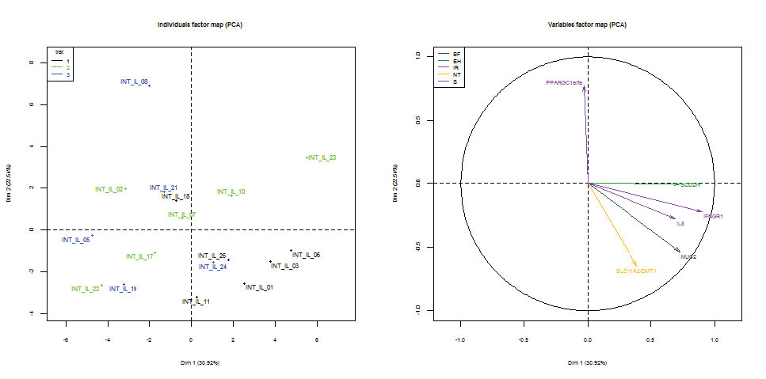

### Exemple: ACP casos = mostres, variables =  gens

**Gràfica de variables (expressions dels gens a les mostres)**

**Obs**: Només es representen els gens significatius (ANOVA) i que estiguin ben explicats en l'espai de les dues primeres components.  

- La primera component explica aproximadament un 31% de la variabilitat total de les mitjanes en els diversos gens. La segona component contribueix en un 22,5% aproximadament. Globalment, en dimensió 2 la pèrdua d'informació dels nivells mitjans d'expressió és d'un 47,5%, perquè estem usant tots els gens, els significatius i els que no ho són.
- Es pot observar una correlació moderada i positiva entre els gens significatius següents:  "IL8, IFNGR1, MUC2, SOD2m", que expliquen la primera component. 
- La correlació dels gens anteriors amb el gen  "PPARGC1alfa" és  nul·la, i negativa amb el gen  "SLC11A2/DMT1". Aquests dos gens expliquen la segona component.  
- Altres gens significatius a l'ANOVA no estan representats en dim2, necessitarien altres components.
- La majoria de gens significatius i ben representats estan al quart quadrant.
- La funció del gen està representada pel color de la fletxa (llegenda de colors). No es veu cap patró clar. 
 

**Gràfica de casos (mostres)** 

 - La gràfica de la dreta ens mostra les mostres  (punts) i el tractament que se'ls ha aplicat (llegenda de colors).  
 - Les mostres del tractament 1 (negre) se situen majoritàriament al quart quadrant. Per tant, el tractament 1 té nivells més elevats d'expressió en els gens "IL8, IFNGR1, MUC2, SOD2m" que se situen al mateix quadrant.
 - Hi ha una mostra destacada a la part positiva (superior) de l'eix vertical: Aquesta mostra és del tractament 3 i té nivells elevats en el gen "PPARGC1alfa" i nivells baixos en els gens "IL8, IFNGR1, MUC2, SOD2m" que estan al quadrant oposat.
